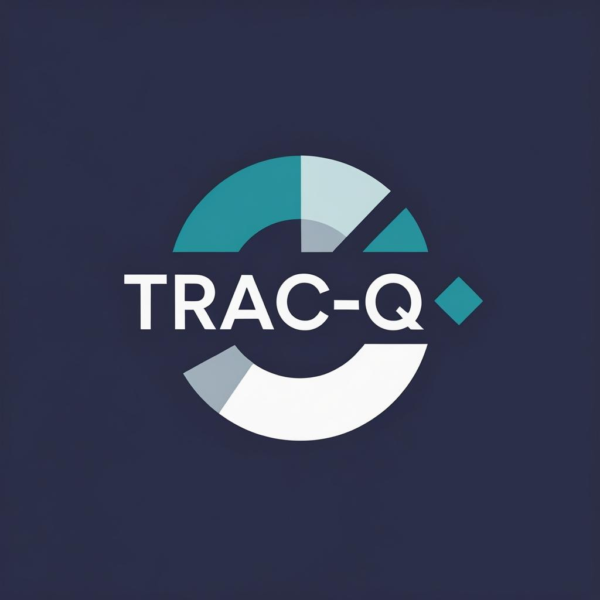

# Trac-Q: A Modern Finance Management App



**Trac-Q** is a comprehensive, modern finance management application designed to help users track their expenses, manage budgets, and achieve their financial goals with ease. This project was developed as a part of the BCA 4th Semester curriculum.

---

## 👥 Authors

- **Bipin Rijal**
- **Utsav Tamang**

---

## ✨ Key Features

- **📊 Interactive Dashboard**: Get a quick overview of your financial health with dynamic charts and summaries for income, expenses, and savings.
- **💸 Transaction Management**: Easily add, view, and categorize your daily transactions.
- **💰 Budget Tracking**: Set monthly budgets and monitor your spending to stay on track.
- **👤 User Profiles**: Personalize your experience with a customizable user profile, including a profile picture editor with zoom, rotate, and shape options.
- **🔐 Secure Authentication**: Robust login and sign-up system powered by Supabase, including an OTP-based password reset flow.
- **👑 Admin Panel**: A dedicated section for administrators to manage users and view system-wide statistics.
- **💹 Live Exchange Rates**: A real-time currency exchange rate viewer that updates automatically.
- **🎨 Dual Theme**: Seamlessly switch between a light and dark mode for comfortable viewing.
- **📱 Fully Responsive**: A beautiful and intuitive user interface that works flawlessly on desktops, tablets, and mobile devices.
- **🔒 Secure & Private**: Built with security in mind, ensuring your financial data is safe.

---

## 🛠️ Tech Stack

- **Frontend**: React, TypeScript, Vite
- **Backend & Database**: Supabase (Authentication, PostgreSQL, Storage)
- **Styling**: Tailwind CSS, Shadcn UI
- **Routing**: React Router DOM
- **State Management**: React Context API
- **Charts**: Recharts
- **Notifications**: React Hot Toast

---

## 🚀 Getting Started

Follow these instructions to get a local copy up and running.

### Prerequisites

- Node.js (v18 or higher)
- npm or yarn
- A Supabase account (free tier is sufficient)

### Installation & Setup

1.  **Clone the repository:**
    ```sh
    git clone [https://github.com/your-repository-url/trac-q.git](https://github.com/your-repository-url/trac-q.git)
    cd trac-q
    ```

2.  **Install dependencies:**
    ```sh
    npm install
    ```

3.  **Set up Supabase Environment Variables:**
    - Create a new file named `.env.local` in the root of the project.
    - Go to your Supabase project dashboard.
    - Navigate to **Project Settings** > **API**.
    - Copy your **Project URL** and **anon (public) key**.
    - Add them to your `.env.local` file:
      ```env
      VITE_SUPABASE_URL=YOUR_SUPABASE_PROJECT_URL
      VITE_SUPABASE_ANON_KEY=YOUR_SUPABASE_ANON_KEY
      ```

4.  **Set up Supabase Database:**
    - Go to the **SQL Editor** in your Supabase dashboard.
    - Run the SQL script found in [supabase_otp_table.sql](cci:7://file:///c:/Users/LOQ/Documents/4th%20sem%20programs/Trac-Q/supabase_otp_table.sql:0:0-0:0) to create the necessary table for the OTP password reset feature.
    - Ensure you have set up your `profiles` table and other required tables as per your project's schema.

5.  **Run the development server:**
    ```sh
    npm run dev
    ```

6.  **Open the application:**
    Open [http://localhost:5173](http://localhost:5173) (or the port specified in your terminal) to view it in your browser.

---
